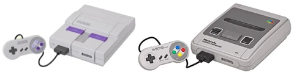

# 米国版スーファミとの違い

米国向けのスーファミは、米国の映像方式が日本と違うこともあって日本向けのスーファミとはすこし違ったものになっています。

日本向けのスーファミは`Super Famicom(SFC)`、米国向けのスーファミは`Super Nintendo(SNES)`と呼ばれています。

## PALとNTSC

[F-ZEROにおけるPALとNTSCの違い](https://web.archive.org/web/20190801031357/http://cybermystery.web.fc2.com/research/1/1.html) を参照してください。

米国向けのスーファミ(画像左, 以降、SNES)はNTSC方式で、解像度は256x224pxです。

日本向けのスーファミ(画像右, 以降、SFC)はPAL方式で、解像度は256x240pxです。

SFCのほうがY方向に解像度が高いですが、この増えた解像度はほとんど使われずだいたい黒で塗りつぶされています。

