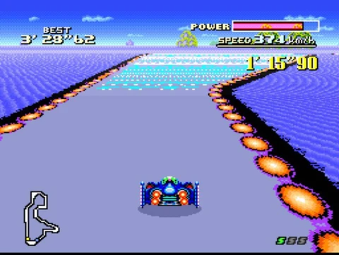

# グラフィック

## 📌 用語解説

### Super PPU

- `Super Picture Processing Unit`
- S-PPUと略されます
- ファミコンのPPUを拡張したもの

### VRAM

- `Video RAM`
- S-PPUが利用する64KBのRAM
- タイルデータを保持しています
  - 画面モードによってタイルの大きさが異なります
  - タイルの大きさは 8x8px か 16x16px のどちらか 

### OAM

- `Object Attribute Memory`
- スプライトのアトリビュート(メタデータ)を保持しています
- 最大128個のスプライトのアトリビュートを持っています
- NESのOAMと似ているが、進化しています

**OAMの各エントリが持っているスプライトのデータ**

- スプライトのX座標
  - 9bit, 0-511
- スプライトのY座標
  - 8bit, 0-239
- タイルID(8bit)
- スプライトのネームテーブル
- パレットID
  - 0~7
  - スプライトは後半の8つのサブパレットでサブパレットインデックスを使用しているので、使用されるIDは7+Nです。
- スプライトの大きさ
  - 1bit
  - 0の場合は 16x16px(16x16pxのタイルが1枚)
  - 1の場合は 32x32px(16x16pxのタイルが2x2枚)
- スプライトの優先度
  - OAMの優先度
    - 2bit
    - 背景画像に対するスプライトの優先順位を決定します。
  - スプライト同士の優先度
    - OAMのエントリのインデックスが大きくなるほど優先度は小さくなります。
    - つまり0が最大です

## 🗺 タイルマップ

背景に関して、SNESは7つのビデオモードが存在しています。

- 各モードはMode0, Mode1, ... Mode7と呼ばれます。
- Mode7にはMode7 EXTBGと呼ばれるサブモードが存在します。
- 各モードごとに、利用できる背景レイヤの枚数が異なります。
- 各モードごとに、利用可能な背景レイヤの色が異なっています。
- 各モードでは、レンダリングの特性が若干異なります。

**背景レイヤが使える色数**

モード | BG1 | BG2 | BG3 | BG4 
-- | -- | -- | -- | -- 
Mode0 | 4 | 4 | 4 | 4 
Mode1 | 16 | 16 | 4 | - 
Mode2 | 16 | 16 | - | - 
Mode3 | 256 | 16 | - | - 
Mode4 | 256 | 4 | - | - 
Mode5 | 16 | 4 | - | - 
Mode6 | 16 | - | - | - 
Mode7 | 256 | - | - | - 
Mode7 EXTBG | 256 | 128 | - | - 

## 🌄 背景レイヤについて

SNESでは、BG1~BG4と名付けられた最大4つの背景レイヤを扱うことができます。

- どのレイヤも必要に応じてスクロールが可能です
- タイルマップのサイズについて
  - 32x32, 32x64, 64x32, 64x64タイルのいずれか
  - ブロックの大きさはタイルマップによって異なります
    - 1ブロック = 16x16pxのタイルが1枚 = 16x16px
    - 1ブロック = 16x16pxのタイルが2枚 = 32x32px
- タイルマップの各エントリが持つタイルのプロパティについて
  - タイルを垂直/水平に反転させるかのフラグ
  - タイルの優先度
  - パレットID
    - 3bit, 0~7
    - Recall that planes use the 1st 8 sub palettes of CGRAM; the 2nd 8 is used for sprites
  - タイルID

## 📹 各ビデオモードについて

### Mode0

TODO

### Mode1

TODO

### Mode2

TODO

### Mode3

TODO

### Mode4

TODO

### Mode5

TODO

### Mode6

TODO

### Mode7

- BG1のみ
- 256色利用可能
- 背景レイヤを行列変換可能な特殊モード
- スーパマリオカートやF-ZEROで擬似3Dをするときに利用されます
- 詳細は[こちら](https://wiki.superfamicom.org/snes/show/Backgrounds)

## 🎨 CGRAM

- `Color Graphics RAM`
- パレットの色情報を持っています
- 256個のパレットエントリがあります
- 各ビデオモードでは、256のパレットエントリをN色のサブパレットに分割しています。
  - Nの値はビデオモードによって異なります。
  - デフォルトでは16色のサブパレットを16個持つようになっています。
  - デフォルトでは最初の8つのサブパレットは背景タイル用で、後の8つのサブパレットはスプライト用です。
  - サブパレットの最初の色は透明色として扱います。

